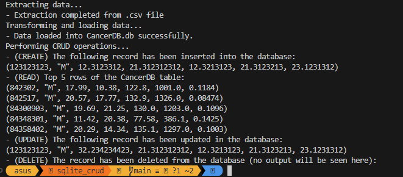

# Individual Project 2: Rust CLI Binary with SQLite
Adil Keku Gazder <br>
ag825, adil.gazder@duke.edu <br>
IDS 706: Data Engineering Systems <br>
Duke University, Fall 2024 <br>
##

### About the project
[](https://github.com/nogibjj/ag825_individual_project_2/actions/workflows/CI.yml)

The aim with this project was to read a .csv file, read it into a database and perform CRUD (Create, Read, Update, Delete) operations on the database. 

The dataset used for this project was acquired from Kaggle (Cancer Data -> Cancer_Data.csv) and this dataset was modified to include only the following few columns:
- id
- diagnosis
- radius_mean
- texture_mean
- perimeter_mean
- area_mean
- smoothness_mean

Link to the dataset: (https://www.kaggle.com/datasets/erdemtaha/cancer-data/data?select=Cancer_Data.csv)


##
### Repository Structure


```
ag825_individual_project_2/
├── .devcontainer/
│   ├── devcontainer.json
│   └── Dockerfile
├── .github/
│   └── workflows/CI.yml
├── .vs
├── sqlite_crud
│    ├── src/
│    │   ├── lib.rs
│    │   ├── test.rs
│    │   └── main.rs
│    ├── target/
│    ├── build.rs
│    ├── Cancer_Data.csv
│    ├── CancerDb.db
│    ├── Cargo.lock
│    ├── Cargo.toml
│    ├── Makefile
├── .gitignore
├── README.md
└── output.png
```

##
### Output and Results

The details about the CRUD operations performed have been detailed below:

> [CREATE] create() in src/lib.rs
    
- Inserts a new record into the CancerDB.db file (creates a record with unique ID 123123123)

>  [READ] read() in src/lib.rs
- Reads the top 5 rows from CancerDB.db
    
>  [UPDATE] update() in src/lib.rs

- Updates the value of the diagnosis feild for the record with unique ID: 123123123 in CancerDB.db

> [DELETE] delete() in src/lib.rs

- Deletes the record with unique ID: 123123123 in CancerDB.db

GenAI (and ChatGPT in specific) has been used to assist in this project for some of the syntax generation and debugging on compilation. 

Test cases for the CRUD() function (which inturn calls the functions create(), read(), update() and delete()) have been added under the test.rs file.

The output has been shown below:



##
### Binary File Link

The binary file for this project can be accessed here: https://github.com/nogibjj/ag825_individual_project_2/actions/runs/11604711746/artifacts/2126283622